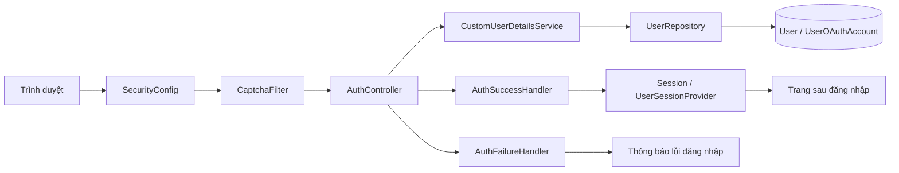
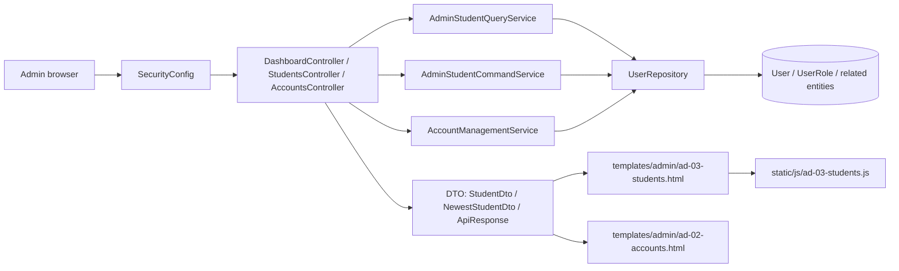
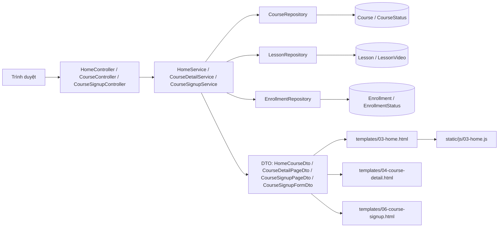

# BKIS - 3 luồng chính trong project

Tài liệu này vẽ 3 luồng chính của project BKIS dựa trên cấu trúc mã nguồn hiện tại. Mục tiêu là nhìn nhanh được đường đi của request, lớp xử lý, dữ liệu và giao diện liên quan.

## 1. Luồng đăng nhập và bảo mật

### Ý nghĩa

- `SecurityConfig` chặn và điều phối toàn bộ luồng xác thực.
- `CaptchaFilter` xử lý bước kiểm tra captcha trước khi xác thực hoàn tất.
- `AuthController` nhận request đăng nhập và điều hướng vào cơ chế Spring Security.
- `CustomUserDetailsService` đọc dữ liệu người dùng từ `UserRepository`.
- `AuthSuccessHandler` và `AuthFailureHandler` xử lý kết quả đăng nhập.
- `UserSessionProvider` và session liên quan giữ trạng thái người dùng sau khi đăng nhập.

## 2. Luồng quản trị student và account

### Ý nghĩa

- Khu admin đi qua lớp bảo mật trước khi vào controller.
- `DashboardController`, `StudentsController`, `AccountsController` là các điểm vào chính cho màn hình quản trị.
- Phần đọc dữ liệu sinh viên thường đi qua `AdminStudentQueryService`, phần cập nhật đi qua `AdminStudentCommandService`.
- Quản lý tài khoản dùng `AccountManagementService`.
- Dữ liệu hiển thị được map sang DTO rồi đẩy ra template admin và file JS tương ứng.

## 3. Luồng khóa học và đăng ký khóa học

### Ý nghĩa

- `HomeController`, `CourseController`, `CourseSignupController` là các entry point cho public course flow.
- `HomeService`, `CourseDetailService`, `CourseSignupService` chứa logic nghiệp vụ chính.
- Dữ liệu khóa học, bài học, video và đăng ký được truy vấn qua các repository riêng.
- Kết quả được gom thành DTO rồi render ra các trang public tương ứng.

## Ghi chú đọc nhanh

- Public pages nằm chủ yếu trong `src/main/resources/templates`.
- Admin pages nằm trong `src/main/resources/templates/admin`.
- Business logic nằm trong `src/main/java/vn/edu/bkis/service` và `src/main/java/vn/edu/bkis/service/admin`.
- Data access nằm trong `src/main/java/vn/edu/bkis/repository`.
- Security luôn là lớp vào đầu tiên cho các request liên quan đến đăng nhập và quyền truy cập.
