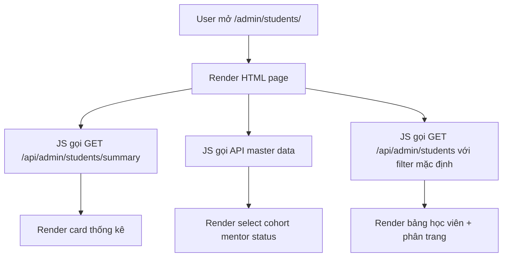
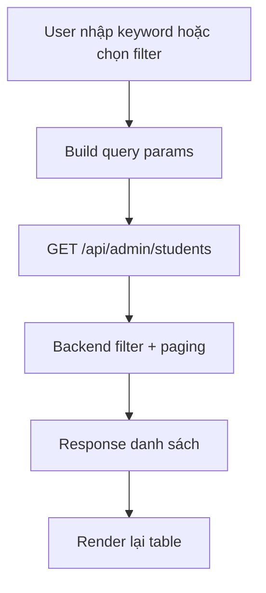
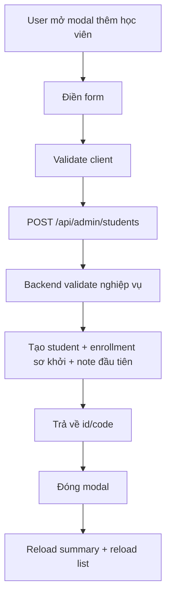

# Admin Student Page REST Design

## 1. Mục tiêu

Tài liệu này mô tả thiết kế RESTful API cho trang quản lý học viên:

- Mock page: `src/main/resources/mock/admin/student.html`
- Runtime page route hiện có: `GET /admin/students/`
- Runtime template hiện có: `src/main/resources/templates/admin/ad-03-students.html`

Mục tiêu là chuyển page này từ mock data tĩnh sang lấy dữ liệu thật từ backend và hỗ trợ CRUD đầy đủ cho học viên.

## 2. Phạm vi chức năng của page

Từ UI hiện tại, page đang có các nhóm chức năng sau:

1. Hiển thị số liệu tổng quan học viên.
2. Tìm kiếm, lọc, phân trang danh sách học viên.
3. Xem nhanh chi tiết học viên trong modal.
4. Tạo mới học viên.
5. Cập nhật nhanh trạng thái, mentor, cohort, note, follow-up.
6. Nhập danh sách học viên từ file.
7. Gửi nhắc học viên hoặc thao tác hỗ trợ.
8. Lưu bộ lọc thường dùng.

## 3. Thiết kế route

Tách rõ 2 lớp route:

- Page route:
  - `GET /admin/students/`
- REST API route:
  - prefix đề xuất: `/api/admin/students`

Lý do:

- `/admin/students/` dùng để render HTML.
- `/api/admin/students` dùng cho JS gọi AJAX/fetch.
- Giữ thống nhất với các module admin khác, dễ tách controller `@Controller` và `@RestController`.

## 4. Mô hình dữ liệu đề xuất cho page

### 4.1 Student item trong grid

```json
{
  "id": "stu_01JABCXYZ",
  "code": "STU-2026-0001",
  "fullName": "Tu Nguyen",
  "email": "tu.nguyen@mail.com",
  "phone": "0901234567",
  "courseId": 12,
  "courseName": "Product Discovery",
  "cohortCode": "PD-01-2026",
  "mentorId": "u_mentor_001",
  "mentorName": "Minh Do",
  "status": "ACTIVE",
  "statusLabel": "Đang học",
  "progressPercent": 72,
  "progressLabel": "Module 5/7",
  "riskLevel": "LOW",
  "riskLabel": "Thấp",
  "joinedAt": "2025-12-02",
  "followUpDate": "2026-01-10",
  "hasOpenTicket": false,
  "missingAssignmentCount": 0,
  "missedLiveSessionCount": 0,
  "lastNote": "Giữ nhịp giao bài hàng tuần",
  "lastNoteUpdatedAt": "2026-01-03T08:00:00Z",
  "lastNoteUpdatedBy": "Minh Do"
}
```

### 4.2 Student detail cho modal

```json
{
  "id": "stu_01JABCXYZ",
  "code": "STU-2026-0001",
  "fullName": "Tu Nguyen",
  "email": "tu.nguyen@mail.com",
  "phone": "0901234567",
  "course": {
    "id": 12,
    "name": "Product Discovery"
  },
  "cohort": {
    "code": "PD-01-2026",
    "name": "Product Discovery January 2026"
  },
  "mentor": {
    "id": "u_mentor_001",
    "name": "Minh Do"
  },
  "status": "ACTIVE",
  "statusLabel": "Đang học",
  "progressPercent": 72,
  "progressLabel": "Module 5/7",
  "riskLevel": "LOW",
  "goals": [
    "Thăng tiến nội bộ",
    "Nắm chắc discovery"
  ],
  "timeline": [
    {
      "time": "2025-12-22T10:00:00Z",
      "label": "Hoàn thành phỏng vấn user"
    },
    {
      "time": "2025-12-28T10:00:00Z",
      "label": "Nhận feedback module 4"
    }
  ],
  "latestNote": {
    "content": "Giữ nhịp giao bài hàng tuần, nhấn mạnh OKR đầu quý",
    "updatedAt": "2026-01-03T08:00:00Z",
    "updatedBy": "Minh Do"
  },
  "automation": {
    "assignmentReminderEnabled": true
  },
  "joinedAt": "2025-12-02",
  "followUpDate": "2026-01-10"
}
```

### 4.3 Dashboard summary cho page

```json
{
  "activeStudents": 2312,
  "newThisWeek": 56,
  "onboardingStudents": 124,
  "inactiveEmailCount": 18,
  "openSupportTickets": 32
}
```

## 5. API REST cần có

## 5.1 Lấy summary cho phần card đầu trang

- Method: `GET`
- URL: `/api/admin/students/summary`
- Mục đích: load 3 card thống kê đầu trang.

Response:

```json
{
  "success": true,
  "data": {
    "activeStudents": 2312,
    "newThisWeek": 56,
    "onboardingStudents": 124,
    "inactiveEmailCount": 18,
    "openSupportTickets": 32
  }
}
```

## 5.2 Lấy danh sách học viên có filter + phân trang

- Method: `GET`
- URL: `/api/admin/students`

Query params đề xuất:

- `keyword`
- `status`
- `cohortCode`
- `mentorId`
- `progressFrom`
- `progressTo`
- `activeCourseOnly`
- `hasMissingAssignment`
- `hasMissedLiveSession`
- `hasOpenTicket`
- `page`
- `size`
- `sort`

Ví dụ:

```txt
GET /api/admin/students?keyword=tu&status=ACTIVE&cohortCode=PD-01-2026&page=0&size=10&sort=joinedAt,desc
```

Response:

```json
{
  "success": true,
  "data": {
    "content": [
      {
        "id": "stu_01JABCXYZ",
        "code": "STU-2026-0001",
        "fullName": "Tu Nguyen",
        "email": "tu.nguyen@mail.com",
        "courseName": "Product Discovery",
        "cohortCode": "PD-01-2026",
        "mentorName": "Minh Do",
        "status": "ACTIVE",
        "statusLabel": "Đang học",
        "progressPercent": 72,
        "progressLabel": "Module 5/7",
        "joinedAt": "2025-12-02"
      }
    ],
    "page": 0,
    "size": 10,
    "totalElements": 2450,
    "totalPages": 245,
    "hasNext": true,
    "hasPrevious": false
  }
}
```

## 5.3 Lấy chi tiết một học viên

- Method: `GET`
- URL: `/api/admin/students/{studentId}`
- Mục đích: mở modal chi tiết.

Response:

```json
{
  "success": true,
  "data": {
    "id": "stu_01JABCXYZ",
    "code": "STU-2026-0001",
    "fullName": "Tu Nguyen",
    "email": "tu.nguyen@mail.com",
    "phone": "0901234567",
    "course": {
      "id": 12,
      "name": "Product Discovery"
    },
    "cohort": {
      "code": "PD-01-2026",
      "name": "Product Discovery January 2026"
    },
    "mentor": {
      "id": "u_mentor_001",
      "name": "Minh Do"
    },
    "status": "ACTIVE",
    "statusLabel": "Đang học",
    "progressPercent": 72,
    "progressLabel": "Module 5/7",
    "riskLevel": "LOW",
    "goals": ["Thăng tiến nội bộ", "Nắm chắc discovery"],
    "timeline": [
      {
        "time": "2025-12-22T10:00:00Z",
        "label": "Hoàn thành phỏng vấn user"
      }
    ],
    "latestNote": {
      "content": "Giữ nhịp giao bài hàng tuần",
      "updatedAt": "2026-01-03T08:00:00Z",
      "updatedBy": "Minh Do"
    },
    "automation": {
      "assignmentReminderEnabled": true
    },
    "followUpDate": "2026-01-10"
  }
}
```

## 5.4 Tạo mới học viên

- Method: `POST`
- URL: `/api/admin/students`
- Mục đích: submit form `addStudentModal`.

Request body:

```json
{
  "fullName": "Nguyen Van A",
  "email": "nguyenvana@example.com",
  "courseId": 12,
  "cohortCode": "PD-01-2026",
  "startDate": "2026-04-10",
  "mentorId": "u_mentor_001",
  "goals": [
    "Chuyển nghề",
    "Nâng cấp portfolio"
  ],
  "note": "Học viên đã tư vấn đầu vào"
}
```

Response:

```json
{
  "success": true,
  "message": "Student created successfully",
  "data": {
    "id": "stu_01JNEW001",
    "code": "STU-2026-0248"
  }
}
```

## 5.5 Cập nhật toàn bộ học viên

- Method: `PUT`
- URL: `/api/admin/students/{studentId}`
- Mục đích: edit đầy đủ hồ sơ nếu sau này có màn hình edit riêng.

Request body:

```json
{
  "fullName": "Nguyen Van A",
  "email": "nguyenvana@example.com",
  "phone": "0909999999",
  "courseId": 12,
  "cohortCode": "PD-01-2026",
  "mentorId": "u_mentor_001",
  "status": "ACTIVE",
  "goals": [
    "Chuyển nghề",
    "Nâng cấp portfolio"
  ],
  "followUpDate": "2026-04-18",
  "note": "Đã trao đổi lại với mentor"
}
```

## 5.6 Cập nhật nhanh từ modal

- Method: `PATCH`
- URL: `/api/admin/students/{studentId}`
- Mục đích: lưu `studentQuickUpdateForm`.

Request body:

```json
{
  "status": "PAUSED",
  "mentorId": "u_mentor_002",
  "cohortCode": "FE-02-2026",
  "followUpDate": "2026-04-20",
  "note": "Đề xuất chuyển cohort để cân bằng lịch",
  "assignmentReminderEnabled": false
}
```

Response:

```json
{
  "success": true,
  "message": "Student updated successfully",
  "data": {
    "id": "stu_01JABCXYZ",
    "status": "PAUSED",
    "statusLabel": "Tạm dừng",
    "mentorName": "Thao Tran",
    "cohortCode": "FE-02-2026",
    "followUpDate": "2026-04-20",
    "latestNote": {
      "content": "Đề xuất chuyển cohort để cân bằng lịch",
      "updatedAt": "2026-04-07T09:00:00Z",
      "updatedBy": "admin"
    }
  }
}
```

## 5.7 Xóa học viên

- Method: `DELETE`
- URL: `/api/admin/students/{studentId}`

Khuyến nghị:

- Không hard delete ngay nếu đã có enrollment/payment/progress.
- Nên dùng soft delete hoặc `status = DELETED/INACTIVE`.

Response:

```json
{
  "success": true,
  "message": "Student deleted successfully"
}
```

## 5.8 Import danh sách học viên

- Method: `POST`
- URL: `/api/admin/students/import`
- Content-Type: `multipart/form-data`
- Mục đích: nút `Nhập danh sách`.

Form data:

- `file`: file Excel/CSV

Response:

```json
{
  "success": true,
  "data": {
    "totalRows": 50,
    "successRows": 47,
    "errorRows": 3,
    "errors": [
      {
        "row": 10,
        "message": "Email already exists"
      }
    ]
  }
}
```

## 5.9 Gửi nhắc học viên

- Method: `POST`
- URL: `/api/admin/students/{studentId}/reminders`
- Mục đích: nút `Gửi nhắc`, `Nhắc kích hoạt`, `Gửi tài liệu`.

Request body:

```json
{
  "type": "ACTIVATION",
  "channel": "EMAIL",
  "message": "Vui lòng kích hoạt tài khoản và bắt đầu bài học đầu tiên."
}
```

## 5.10 Gửi thông báo hàng loạt

- Method: `POST`
- URL: `/api/admin/students/bulk-notifications`

Request body:

```json
{
  "filters": {
    "status": "PAUSED",
    "cohortCode": "UX-12-2025"
  },
  "channel": "EMAIL",
  "subject": "Nhắc quay lại lớp học",
  "message": "Mentor đang chờ phản hồi từ bạn."
}
```

## 5.11 Lưu bộ lọc

- Method: `POST`
- URL: `/api/admin/students/saved-filters`

Request body:

```json
{
  "name": "Career Switch Cohort",
  "filters": {
    "status": "ACTIVE",
    "cohortCode": "PD-01-2026",
    "activeCourseOnly": true
  }
}
```

## 5.12 Lấy danh sách bộ lọc đã lưu

- Method: `GET`
- URL: `/api/admin/students/saved-filters`

## 5.13 Xóa bộ lọc đã lưu

- Method: `DELETE`
- URL: `/api/admin/students/saved-filters/{filterId}`

## 5.14 API dữ liệu master để render form/filter

Để page không hard-code select option, cần thêm các API master data:

- `GET /api/admin/courses/options`
- `GET /api/admin/cohorts/options`
- `GET /api/admin/mentors/options`
- `GET /api/admin/student-statuses`

Ví dụ response options:

```json
{
  "success": true,
  "data": [
    {
      "value": "u_mentor_001",
      "label": "Minh Do"
    }
  ]
}
```

## 6. Mapping UI -> API

| Thành phần UI | API |
|---|---|
| Card thống kê đầu trang | `GET /api/admin/students/summary` |
| Bảng danh sách học viên | `GET /api/admin/students` |
| Click vào 1 row để mở modal | `GET /api/admin/students/{studentId}` |
| Nút `Thêm học viên` | `POST /api/admin/students` |
| Form cập nhật nhanh trong modal | `PATCH /api/admin/students/{studentId}` |
| Nút `Nhập danh sách` | `POST /api/admin/students/import` |
| Nút `Gửi nhắc` | `POST /api/admin/students/{studentId}/reminders` |
| Nút `Lưu bộ lọc` | `POST /api/admin/students/saved-filters` |
| Khối filter đã lưu | `GET /api/admin/students/saved-filters` |
| Nút reset/xóa filter đã lưu | `DELETE /api/admin/students/saved-filters/{filterId}` |

## 7. Luồng thao tác của page

## 7.1 Luồng load page



## 7.2 Luồng tìm kiếm và lọc



## 7.3 Luồng xem chi tiết học viên

```mermaid
flowchart TD
    A[User click row học viên] --> B[Lấy studentId từ row]
    B --> C[GET /api/admin/students/{studentId}]
    C --> D[Nhận student detail]
    D --> E[Bind dữ liệu vào modal]
    E --> F[Hiển thị modal]
```

## 7.4 Luồng tạo mới học viên



## 7.5 Luồng cập nhật nhanh từ modal

```mermaid
flowchart TD
    A[User sửa status mentor cohort note] --> B[Submit studentQuickUpdateForm]
    B --> C[PATCH /api/admin/students/{studentId}]
    C --> D[Backend cập nhật dữ liệu]
    D --> E[Ghi activity log]
    E --> F[Trả dữ liệu mới]
    F --> G[Update modal]
    G --> H[Update row trong table hoặc reload list]
```

## 7.6 Luồng xóa học viên

```mermaid
flowchart TD
    A[User bấm xóa] --> B[Confirm]
    B --> C[DELETE /api/admin/students/{studentId}]
    C --> D[Soft delete hoặc inactive]
    D --> E[Reload summary + reload list]
```

## 8. Validation nghiệp vụ cần có

## 8.1 Khi tạo mới

- `fullName` bắt buộc.
- `email` bắt buộc, đúng định dạng, unique.
- `courseId` bắt buộc.
- `cohortCode` bắt buộc.
- `startDate` bắt buộc.
- `mentorId` có thể optional nếu hỗ trợ `Chưa phân`.

## 8.2 Khi cập nhật

- `status` phải thuộc enum cho phép.
- `followUpDate` không nhỏ hơn ngày hiện tại nếu là lịch follow-up mới.
- Không cho chuyển `courseId` tùy ý nếu học viên đã có progress/payment, trừ khi có rule riêng.
- Nếu `status = COMPLETED` thì progress nên đạt ngưỡng đủ điều kiện.

## 8.3 Khi xóa

- Không hard delete nếu tồn tại `payments`, `progress`, `enrollments`.
- Trả mã lỗi nghiệp vụ rõ ràng nếu cần chặn xóa.

## 9. Mã trạng thái và lỗi API

Khuyến nghị:

- `200 OK`: lấy dữ liệu, update thành công.
- `201 Created`: tạo mới thành công.
- `400 Bad Request`: validate lỗi input.
- `404 Not Found`: không tìm thấy học viên.
- `409 Conflict`: email trùng, xung đột dữ liệu.
- `422 Unprocessable Entity`: sai rule nghiệp vụ.

Ví dụ lỗi:

```json
{
  "success": false,
  "message": "Validation failed",
  "errors": [
    {
      "field": "email",
      "message": "Email already exists"
    }
  ]
}
```

## 10. Đề xuất backend class

Các class nên bổ sung:

- `AdminStudentRestController`
- `AdminStudentService`
- `AdminStudentQueryService`
- `AdminStudentCommandService`
- `StudentFilterRequest`
- `CreateStudentRequest`
- `UpdateStudentRequest`
- `StudentSummaryResponse`
- `StudentListItemResponse`
- `StudentDetailResponse`

Route page hiện có có thể giữ nguyên:

- `StudentsController` phục vụ HTML tại `/admin/students/`

REST controller nên tách riêng:

- `@RequestMapping("/api/admin/students")`

## 11. Gợi ý mapping với JS của page

File mock hiện tại đang dùng DOM data tĩnh trong:

- `src/main/resources/mock/admin/student.html`
- `src/main/resources/mock/admin/students.js`

Khi chuyển sang REST thật, JS nên đổi theo hướng:

1. Bỏ data cứng trong HTML table row.
2. Load danh sách qua `GET /api/admin/students`.
3. Khi click row, chỉ giữ `data-student-id`, còn detail gọi `GET /api/admin/students/{id}`.
4. Submit form thêm mới dùng `POST /api/admin/students`.
5. Submit modal update dùng `PATCH /api/admin/students/{id}`.
6. Sau create/update/delete, reload summary và danh sách thay vì append HTML thủ công.

## 12. Trạng thái hiện tại của codebase

Hiện tại codebase mới có:

- Page controller: `src/main/java/vn/edu/bkis/controller/admin/StudentsController.java`
- Route page: `GET /admin/students/`

Chưa thấy:

- REST controller cho admin student page
- service/query đầy đủ cho CRUD học viên ở module admin
- API filter, paging, import, reminder, saved filter

Vì vậy tài liệu này là bản thiết kế API cần bổ sung để triển khai page này theo đúng RESTful.
