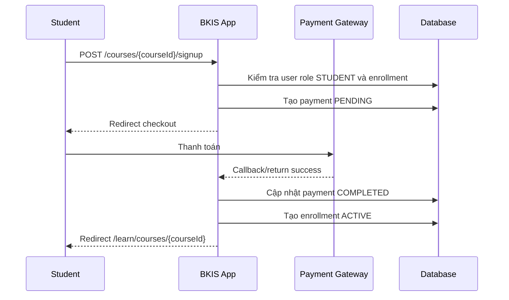

# Luồng Đăng Ký Khóa Học Và Phân Quyền Xem Nội Dung

## Mục Tiêu

Tài liệu này mô tả ý tưởng nghiệp vụ cho chức năng đăng ký khóa học và kiểm soát quyền xem video/tài liệu. Yêu cầu chính:

- Người dùng phải đăng nhập mới được đăng ký khóa học.
- Chỉ user role `STUDENT` mới được đăng ký khóa học và học khóa học.
- Student đã đăng ký khóa học thành công mới được xem toàn bộ video và tài liệu.
- Student chưa đăng ký chỉ được xem thông tin giới thiệu khóa học và nội dung preview nếu hệ thống cho phép.

## Hiện Trạng Codebase

Codebase hiện đã có các bảng phù hợp để triển khai:

| Bảng | Vai trò |
|---|---|
| `users` | Lưu user local, role và trạng thái khóa tài khoản. |
| `courses` | Lưu khóa học. |
| `lessons` | Lưu module/bài học thuộc khóa học. |
| `lesson_videos` | Lưu video thuộc lesson. |
| `payments` | Lưu lịch sử thanh toán khóa học. |
| `enrollments` | Lưu quyền truy cập khóa học của student. |
| `progress` | Lưu tiến độ xem video của student. |

Các enum/role liên quan:

| Thành phần | Giá trị |
|---|---|
| `UserRole` | `STUDENT`, `TEACHER`, `ADMIN`, `INSTRUCTOR` |
| `EnrollmentStatus` | Nên dùng `ACTIVE` để xác định quyền học hợp lệ. |
| `PaymentStatus` | Nên dùng `COMPLETED` để tạo enrollment sau thanh toán. |

## Nguyên Tắc Nghiệp Vụ

### 1. Trang chi tiết khóa học

Trang `/courses/{id}` có thể public để phục vụ bán khóa học.

Người chưa đăng nhập được xem:

- Tên khóa học.
- Mô tả khóa học.
- Giá.
- Giảng viên.
- Danh sách module/video dạng outline.
- Video preview nếu có.

Người chưa đăng nhập không được xem:

- Link video đầy đủ.
- Tài liệu đầy đủ.
- Tiến độ học.

### 2. Đăng ký khóa học

Khi bấm `Đăng ký ngay`:

- Nếu chưa đăng nhập: redirect về `/login`, sau login quay lại luồng đăng ký.
- Nếu đã đăng nhập nhưng không phải `STUDENT`: chặn và hiển thị lỗi phù hợp.
- Nếu là `STUDENT`: cho vào trang đăng ký/thanh toán.
- Nếu đã đăng ký khóa học rồi: chuyển thẳng tới trang học.

### 3. Quyền xem video/tài liệu

User được xem toàn bộ video/tài liệu khi thỏa tất cả điều kiện:

- Đã đăng nhập.
- Role là `STUDENT`.
- Có bản ghi `enrollments` với `student_id = currentUser.id`.
- `course_id` đúng khóa học đang xem.
- `status = ACTIVE`.
- `expires_at` null hoặc lớn hơn thời điểm hiện tại.

Admin/Teacher/Instructor có thể xem nội dung theo nghiệp vụ quản trị, nhưng không nên tính là học viên trong `progress`.

## URL Đề Xuất

| URL | Method | Chức năng | Quyền |
|---|---|---|---|
| `/courses/{courseId}` | `GET` | Xem giới thiệu khóa học | Public |
| `/courses/{courseId}/signup` | `GET` | Màn hình đăng ký khóa học | `STUDENT` |
| `/courses/{courseId}/signup` | `POST` | Tạo yêu cầu đăng ký/thanh toán | `STUDENT` |
| `/courses/{courseId}/checkout` | `GET` | Màn hình thanh toán | `STUDENT` |
| `/courses/{courseId}/payment/complete` | `POST` | Xác nhận thanh toán thành công | System/payment callback hoặc `STUDENT` tùy gateway |
| `/learn/courses/{courseId}` | `GET` | Trang học sau khi đã đăng ký | `STUDENT` + enrollment ACTIVE |
| `/learn/courses/{courseId}/videos/{videoId}` | `GET` | Xem video | `STUDENT` + enrollment ACTIVE |
| `/learn/courses/{courseId}/resources/{resourceId}` | `GET` | Xem/tải tài liệu | `STUDENT` + enrollment ACTIVE |
| `/api/learn/videos/{videoId}/progress` | `POST` | Cập nhật tiến độ xem video | `STUDENT` + enrollment ACTIVE |

## Rule Spring Security Đề Xuất

```java
.authorizeHttpRequests(auth -> auth
        .requestMatchers("/", "/courses/**").permitAll()
        .requestMatchers("/courses/*/signup", "/courses/*/checkout").hasRole("STUDENT")
        .requestMatchers("/learn/**", "/api/learn/**").hasRole("STUDENT")
        .requestMatchers("/admin/accounts/**", "/admin/dashboard/**").hasRole("ADMIN")
        .requestMatchers("/admin/students/**", "/api/admin/students/**").hasAnyRole("ADMIN", "TEACHER")
        .requestMatchers("/admin/courses/**", "/upload/**").hasAnyRole("ADMIN", "TEACHER", "INSTRUCTOR")
        .anyRequest().authenticated())
```

Lưu ý: Spring Security chỉ kiểm tra role ở tầng URL. Điều kiện đã đăng ký khóa học phải kiểm tra thêm trong service/controller bằng `EnrollmentAccessService`.

## Service Đề Xuất

### `EnrollmentAccessService`

Service này là điểm kiểm tra quyền học tập.

Trách nhiệm:

- Kiểm tra user hiện tại có role `STUDENT`.
- Kiểm tra enrollment ACTIVE theo `studentId` và `courseId`.
- Kiểm tra enrollment chưa hết hạn.
- Cung cấp method dùng chung cho trang học, video, tài liệu và progress.

Method đề xuất:

```java
boolean canAccessCourse(String studentId, Long courseId);
void assertCanAccessCourse(String studentId, Long courseId);
boolean hasActiveEnrollment(String studentId, Long courseId);
```

### `CourseSignupService`

Service xử lý đăng ký khóa học.

Trách nhiệm:

- Kiểm tra current user là `STUDENT`.
- Kiểm tra khóa học còn mở bán hoặc đã `PUBLISHED`.
- Nếu khóa học miễn phí: tạo enrollment ACTIVE ngay.
- Nếu khóa học có phí: tạo payment PENDING và chuyển sang checkout.
- Nếu đã có enrollment ACTIVE: không tạo trùng, chuyển sang trang học.

Method đề xuất:

```java
CourseSignupPageDto getSignupPage(Long courseId, String studentId);
CourseSignupResultDto startSignup(Long courseId, String studentId);
```

### `LearningService`

Service lấy dữ liệu trang học.

Trách nhiệm:

- Gọi `EnrollmentAccessService.assertCanAccessCourse(...)`.
- Load toàn bộ lessons, videos, tài liệu.
- Load progress của student.
- Trả DTO cho UI học tập.

Method đề xuất:

```java
CourseLearningPageDto getLearningPage(Long courseId, String studentId);
LessonVideoPlayerDto getVideo(Long courseId, Long videoId, String studentId);
```

## Repository Đề Xuất

### `EnrollmentRepository`

Cần có method kiểm tra enrollment active:

```java
boolean existsByStudentIdAndCourseIdAndStatus(String studentId, Long courseId, EnrollmentStatus status);
Optional<Enrollment> findByStudentIdAndCourseId(String studentId, Long courseId);
```

Nếu cần kiểm tra hết hạn:

```sql
SELECT COUNT(*)
FROM enrollments e
WHERE e.student_id = :studentId
  AND e.course_id = :courseId
  AND e.status = 'ACTIVE'
  AND (e.expires_at IS NULL OR e.expires_at > NOW())
```

## Luồng Di Chuyển Đăng Ký Khóa Học

```mermaid
flowchart TD
    A[User xem trang /courses/{courseId}] --> B[User bấm Đăng ký ngay]
    B --> C{Đã đăng nhập?}
    C -- Không --> D[Redirect /login]
    D --> E[Login thành công]
    E --> F[Quay lại /courses/{courseId}/signup]
    C -- Có --> G{Role là STUDENT?}
    G -- Không --> H[Hiển thị lỗi không được đăng ký khóa học]
    G -- Có --> I{Đã có enrollment ACTIVE?}
    I -- Có --> J[Redirect /learn/courses/{courseId}]
    I -- Không --> K{Khóa học miễn phí?}
    K -- Có --> L[Tạo enrollment ACTIVE]
    L --> J
    K -- Không --> M[Tạo payment PENDING]
    M --> N[Redirect /courses/{courseId}/checkout]
    N --> O{Thanh toán thành công?}
    O -- Không --> P[Giữ payment PENDING hoặc FAILED]
    O -- Có --> Q[Cập nhật payment COMPLETED]
    Q --> R[Tạo enrollment ACTIVE]
    R --> J
```

## Luồng Kiểm Tra Quyền Xem Video/Tài Liệu

```mermaid
flowchart TD
    A[Request /learn/courses/{courseId}/videos/{videoId}] --> B{Đã đăng nhập?}
    B -- Không --> C[Redirect /login]
    B -- Có --> D{Role STUDENT?}
    D -- Không --> E[403 Forbidden]
    D -- Có --> F{Video thuộc courseId?}
    F -- Không --> E
    F -- Có --> G{Có enrollment ACTIVE?}
    G -- Không --> H[Redirect /courses/{courseId} kèm thông báo cần đăng ký]
    G -- Có --> I{Enrollment hết hạn?}
    I -- Có --> H
    I -- Không --> J[Cho xem video/tài liệu]
    J --> K[Cập nhật progress nếu user xem video]
```

## Luồng Dữ Liệu Sau Thanh Toán



## UI Đề Xuất

### Trang chi tiết khóa học

Hiển thị CTA theo trạng thái:

| Trạng thái user | CTA |
|---|---|
| Chưa đăng nhập | `Đăng nhập để đăng ký` |
| Đã đăng nhập nhưng không phải STUDENT | `Chỉ học viên mới được đăng ký` |
| STUDENT chưa đăng ký | `Đăng ký ngay` |
| STUDENT đã đăng ký ACTIVE | `Vào học ngay` |

### Trang học

Chỉ hiển thị khi student có enrollment ACTIVE:

- Video player.
- Danh sách lessons/videos.
- Tài liệu tải xuống.
- Tiến độ học.
- Nút đánh dấu hoàn thành.

### Khi chưa đủ quyền

Không nên chỉ hiện 403 khô cứng. Nên có thông báo nghiệp vụ:

- Chưa đăng nhập: chuyển login.
- Không phải student: hiển thị `Tài khoản hiện tại không thể đăng ký khóa học. Vui lòng dùng tài khoản học viên.`
- Chưa đăng ký: hiển thị `Bạn cần đăng ký khóa học để xem nội dung này.`
- Enrollment hết hạn: hiển thị `Quyền truy cập khóa học đã hết hạn. Vui lòng gia hạn.`

## Bảo Mật Quan Trọng

- Không dựa vào `locked` flag trên DTO UI để bảo vệ video. Phải kiểm tra ở server.
- Không để link video/tài liệu thật xuất hiện trong HTML nếu student chưa có quyền.
- API xem video/tài liệu phải kiểm tra enrollment ACTIVE.
- API progress phải kiểm tra video thuộc course mà student đã đăng ký.
- Không tin `courseId` hoặc `videoId` gửi từ client nếu chưa đối chiếu DB.

## Thứ Tự Triển Khai Đề Xuất

1. Tạo `EnrollmentAccessService`.
2. Thêm method query enrollment ACTIVE trong `EnrollmentRepository`.
3. Cập nhật `CourseDetailService` để biết current student đã đăng ký hay chưa.
4. Cập nhật `04-course-detail.html` để đổi CTA theo trạng thái.
5. Tạo `CourseSignupController` cho `/courses/{courseId}/signup`.
6. Tạo `LearningController` cho `/learn/courses/{courseId}` và video/tài liệu.
7. Cập nhật `SecurityConfig` cho `/learn/**` và `/courses/*/signup`.
8. Sau khi payment gateway hoàn thiện, nối luồng payment COMPLETED -> enrollment ACTIVE.
