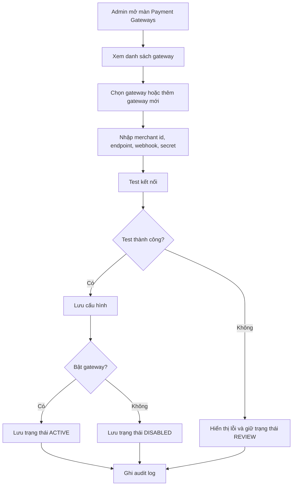
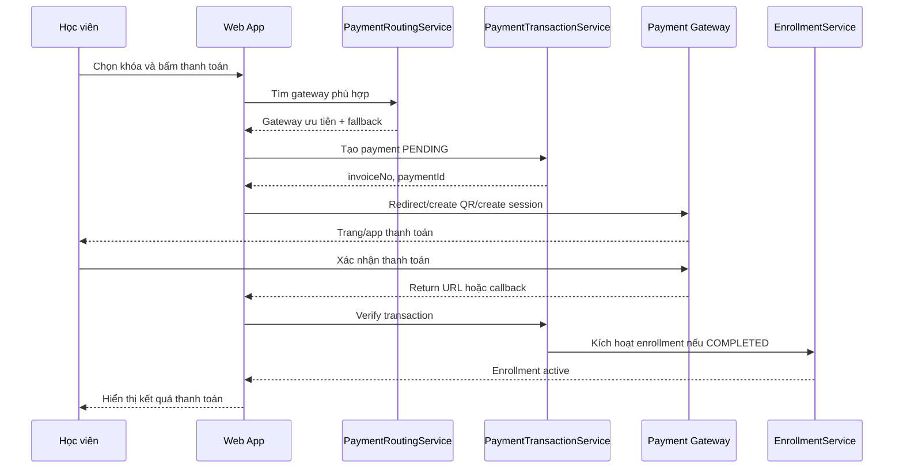
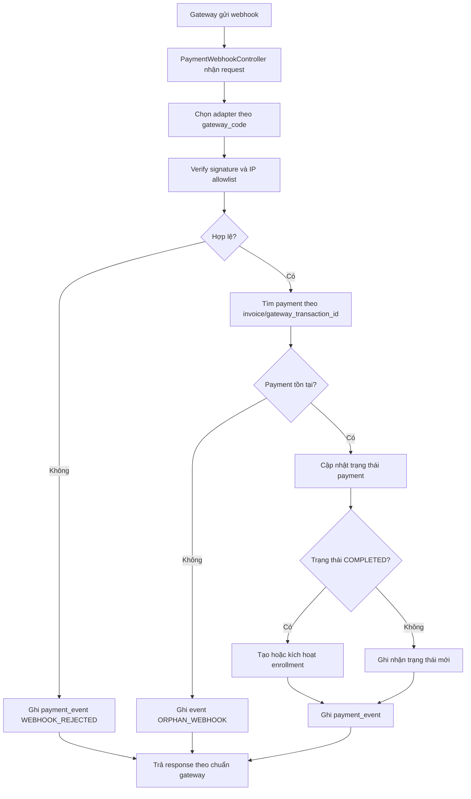
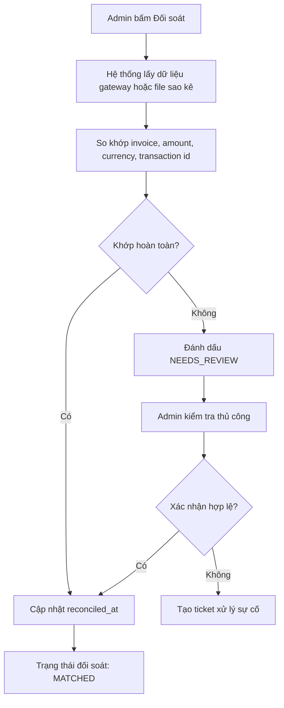
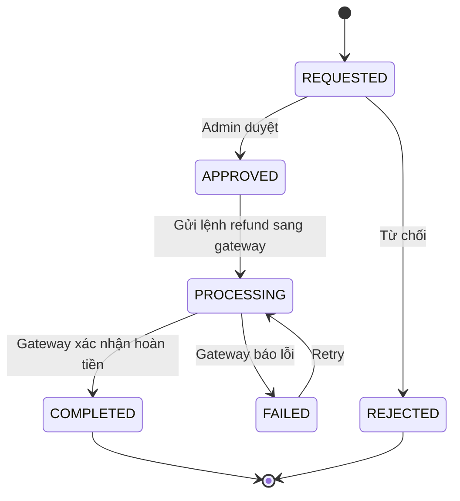
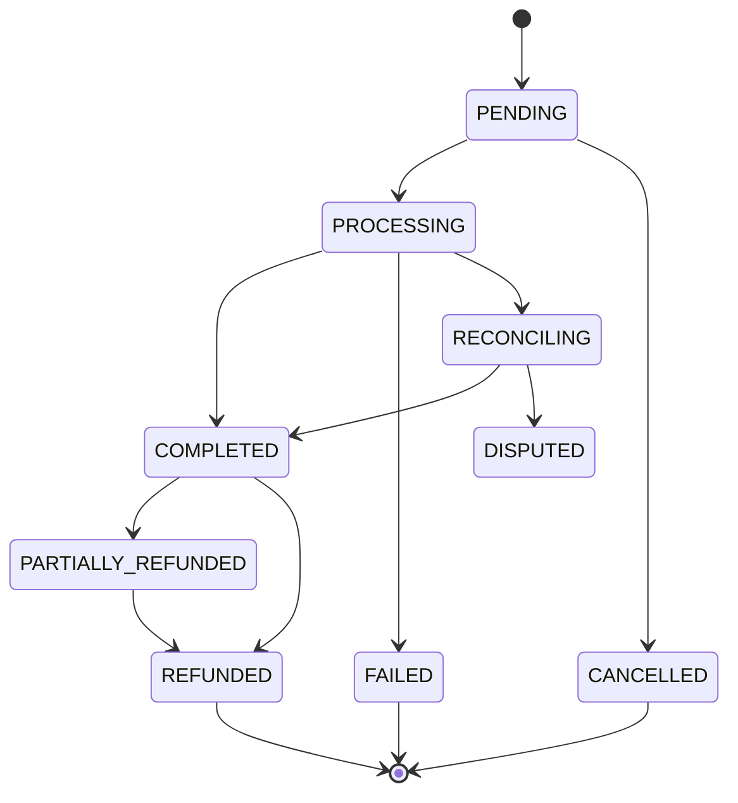
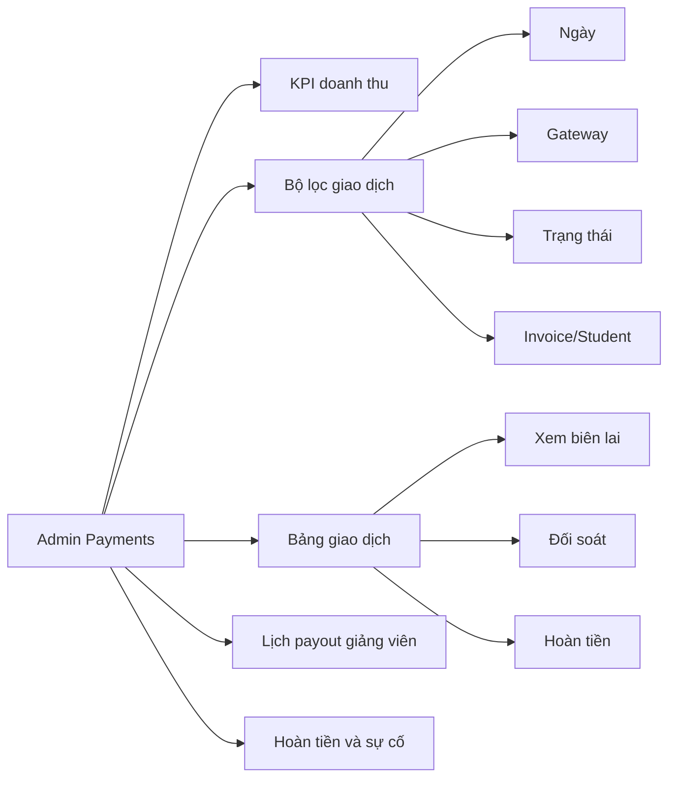

# Nghiệp vụ cấu hình cổng thanh toán và lịch sử thanh toán

## Mục tiêu

Tài liệu này thiết kế nghiệp vụ thanh toán dựa trên 2 mock:

- `src/main/resources/mock/admin/payment-gateways.html`
- `src/main/resources/mock/admin/payments.html`

Phạm vi gồm:

- Cấu hình nhiều cổng thanh toán.
- Định tuyến gateway theo rule.
- Checkout và ghi nhận giao dịch.
- Nhận webhook/callback từ gateway.
- Lịch sử thanh toán.
- Đối soát giao dịch.
- Hoàn tiền.
- Payout cho giảng viên.

## Vai trò người dùng

- `ADMIN`: cấu hình gateway, xem toàn bộ giao dịch, đối soát, hoàn tiền, xuất báo cáo.
- `ACCOUNTING`: đối soát, xuất báo cáo, xử lý payout, xem lịch sử thanh toán.
- `STUDENT`: thanh toán khóa học, xem biên lai, yêu cầu hoàn tiền nếu policy cho phép.
- `TEACHER`: xem doanh thu/payout của khóa học thuộc quyền phụ trách.
- `SYSTEM`: xử lý webhook, cập nhật trạng thái payment, tạo enrollment, ghi audit log.

## Khái niệm chính

### Payment Gateway

Gateway là cấu hình kết nối với một nhà cung cấp thanh toán, ví dụ:

- VNPay
- MoMo
- Stripe
- PayPal
- Chuyển khoản ngân hàng

Một gateway có thể ở các trạng thái:

- `DRAFT`: mới tạo, chưa đủ cấu hình.
- `ACTIVE`: đang được phép dùng khi checkout.
- `DISABLED`: tạm tắt.
- `REVIEW`: cần kiểm tra trước khi bật.
- `ERROR`: có lỗi kết nối hoặc webhook.

### Payment Transaction

Transaction là một lần thanh toán của học viên cho một đơn hàng/khóa học.

Trạng thái đề xuất:

- `PENDING`: đã tạo giao dịch, chờ học viên thanh toán.
- `PROCESSING`: gateway đã nhận giao dịch, đang xử lý.
- `COMPLETED`: thanh toán thành công.
- `FAILED`: thanh toán thất bại.
- `CANCELLED`: học viên hủy hoặc hết thời gian thanh toán.
- `REFUNDED`: đã hoàn tiền toàn phần.
- `PARTIALLY_REFUNDED`: hoàn tiền một phần.
- `RECONCILING`: đang chờ đối soát.
- `DISPUTED`: có tranh chấp/khiếu nại.

### Reconciliation

Đối soát là quá trình so khớp dữ liệu nội bộ với dữ liệu gateway/ngân hàng để đảm bảo:

- Số tiền khớp.
- Mã giao dịch khớp.
- Trạng thái cuối cùng khớp.
- Không có giao dịch trùng.
- Không bỏ sót giao dịch thành công từ gateway.

### Refund

Refund là hoàn tiền cho học viên. Refund có thể:

- Hoàn toàn phần.
- Hoàn một phần.
- Xử lý qua gateway.
- Xử lý thủ công qua chuyển khoản.

## Chức năng admin: cấu hình gateway

Route đề xuất:

- `GET /admin/payment-gateways/`
- `POST /admin/payment-gateways/`
- `POST /admin/payment-gateways/{id}/update`
- `POST /admin/payment-gateways/{id}/enable`
- `POST /admin/payment-gateways/{id}/disable`
- `POST /admin/payment-gateways/{id}/test`
- `POST /admin/payment-gateways/{id}/rotate-secret`
- `POST /admin/payment-gateways/rules`

Chức năng cần có:

- Xem danh sách gateway.
- Thêm gateway mới.
- Cập nhật merchant id, partner code, endpoint, webhook URL.
- Bật/tắt gateway.
- Chuyển sandbox/live.
- Cấu hình priority routing.
- Cấu hình phí giao dịch.
- Cấu hình IP allowlist.
- Test kết nối.
- Rotate secret key.
- Xem health check gần đây.
- Cấu hình fallback gateway.

Quy tắc bảo mật:

- Không hiển thị secret key dạng plain text sau khi đã lưu.
- Secret key phải được mã hóa hoặc lưu qua secret manager.
- Webhook phải verify signature trước khi cập nhật payment.
- Mọi thay đổi cấu hình gateway phải ghi audit log.
- Chỉ `ADMIN` được rotate secret hoặc bật live mode.

## Chức năng admin: lịch sử thanh toán

Route đề xuất:

- `GET /admin/payments/`
- `GET /admin/payments/{id}`
- `POST /admin/payments/manual`
- `POST /admin/payments/{id}/reconcile`
- `POST /admin/payments/{id}/refund`
- `POST /admin/payments/export`

Chức năng cần có:

- Xem KPI doanh thu.
- Lọc theo khoảng ngày.
- Lọc theo gateway.
- Lọc theo trạng thái.
- Lọc theo course/product.
- Tìm theo invoice, student, email, transaction id.
- Xem chi tiết giao dịch.
- Xem biên lai.
- Xuất CSV.
- Đối soát một giao dịch.
- Đối soát theo batch.
- Ghi nhận thanh toán thủ công.
- Tạo ticket hoàn tiền.

## Chức năng student: checkout

Route đề xuất:

- `GET /checkout/{registrationId}`
- `POST /checkout/{registrationId}/pay`
- `GET /payments/return/{gatewayCode}`
- `GET /payments/{paymentId}/receipt`

Chức năng cần có:

- Hiển thị order summary.
- Chọn gateway.
- Áp dụng coupon nếu có.
- Tạo payment pending.
- Redirect sang gateway hoặc hiển thị QR/manual instruction.
- Nhận return URL từ gateway.
- Hiển thị trạng thái thành công/thất bại.
- Sau khi thành công, tạo hoặc kích hoạt `Enrollment`.

## Dữ liệu đề xuất

### Bảng `payment_gateways`

```sql
CREATE TABLE payment_gateways (
    id BIGINT AUTO_INCREMENT PRIMARY KEY,
    code VARCHAR(50) NOT NULL,
    name VARCHAR(255) NOT NULL,
    provider_type VARCHAR(50) NOT NULL,
    status VARCHAR(20) NOT NULL,
    environment VARCHAR(20) NOT NULL,
    merchant_id VARCHAR(255),
    partner_code VARCHAR(255),
    encrypted_secret_key TEXT,
    payment_endpoint VARCHAR(500),
    return_url VARCHAR(500),
    webhook_url VARCHAR(500),
    ip_allowlist TEXT,
    priority_order INT,
    transaction_fee_percent DECIMAL(5,2),
    enabled BOOLEAN DEFAULT FALSE,
    sandbox_enabled BOOLEAN DEFAULT TRUE,
    created_by VARCHAR(255),
    updated_by VARCHAR(255),
    created_at DATETIME,
    updated_at DATETIME,
    UNIQUE KEY uk_payment_gateways_code (code)
);
```

### Bảng `payment_gateway_rules`

```sql
CREATE TABLE payment_gateway_rules (
    id BIGINT AUTO_INCREMENT PRIMARY KEY,
    name VARCHAR(255) NOT NULL,
    currency VARCHAR(10),
    product_type VARCHAR(50),
    course_tag VARCHAR(100),
    primary_gateway_code VARCHAR(50) NOT NULL,
    fallback_gateway_code VARCHAR(50),
    status VARCHAR(20) NOT NULL,
    priority_order INT,
    created_at DATETIME,
    updated_at DATETIME
);
```

### Bảng `payments`

Bảng `payments` hiện có nên mở rộng thêm các cột:

```sql
ALTER TABLE payments
    ADD COLUMN invoice_no VARCHAR(50),
    ADD COLUMN gateway_code VARCHAR(50),
    ADD COLUMN gateway_transaction_id VARCHAR(255),
    ADD COLUMN currency VARCHAR(10),
    ADD COLUMN payment_method VARCHAR(50),
    ADD COLUMN paid_at DATETIME,
    ADD COLUMN reconciled_at DATETIME,
    ADD COLUMN failure_reason VARCHAR(500),
    ADD COLUMN raw_gateway_payload TEXT;
```

### Bảng `payment_events`

```sql
CREATE TABLE payment_events (
    id BIGINT AUTO_INCREMENT PRIMARY KEY,
    payment_id BIGINT NOT NULL,
    event_type VARCHAR(50) NOT NULL,
    old_status VARCHAR(20),
    new_status VARCHAR(20),
    gateway_code VARCHAR(50),
    gateway_event_id VARCHAR(255),
    payload TEXT,
    created_at DATETIME,
    CONSTRAINT fk_payment_events_payment FOREIGN KEY (payment_id) REFERENCES payments(id)
);
```

### Bảng `refund_requests`

```sql
CREATE TABLE refund_requests (
    id BIGINT AUTO_INCREMENT PRIMARY KEY,
    payment_id BIGINT NOT NULL,
    student_id VARCHAR(36) NOT NULL,
    amount DECIMAL(19,2) NOT NULL,
    reason VARCHAR(500),
    status VARCHAR(20) NOT NULL,
    gateway_refund_id VARCHAR(255),
    requested_at DATETIME,
    approved_at DATETIME,
    completed_at DATETIME,
    created_by VARCHAR(255),
    updated_by VARCHAR(255),
    CONSTRAINT fk_refund_requests_payment FOREIGN KEY (payment_id) REFERENCES payments(id)
);
```

### Bảng `instructor_payout_batches`

```sql
CREATE TABLE instructor_payout_batches (
    id BIGINT AUTO_INCREMENT PRIMARY KEY,
    batch_code VARCHAR(50) NOT NULL,
    status VARCHAR(20) NOT NULL,
    scheduled_at DATETIME,
    paid_at DATETIME,
    total_amount DECIMAL(19,2),
    instructor_count INT,
    gateway_code VARCHAR(50),
    created_at DATETIME,
    updated_at DATETIME,
    UNIQUE KEY uk_payout_batches_code (batch_code)
);
```

## Module backend đề xuất

### Controller

- `AdminPaymentController`
- `AdminPaymentGatewayController`
- `CheckoutController`
- `PaymentWebhookController`
- `PaymentReceiptController`

### Service

- `PaymentGatewayConfigService`
- `PaymentRoutingService`
- `CheckoutService`
- `PaymentTransactionService`
- `PaymentWebhookService`
- `PaymentReconciliationService`
- `RefundService`
- `InstructorPayoutService`

### Adapter

Tạo interface chung:

```java
public interface PaymentGatewayAdapter {
    PaymentInitResult createPayment(PaymentInitCommand command);
    PaymentVerificationResult verifyReturn(Map<String, String> params);
    PaymentWebhookResult verifyWebhook(String rawBody, Map<String, String> headers);
    RefundResult refund(RefundCommand command);
}
```

Implementation đề xuất:

- `VnPayGatewayAdapter`
- `MoMoGatewayAdapter`
- `StripeGatewayAdapter`
- `BankTransferGatewayAdapter`

## Luồng cấu hình gateway



## Luồng checkout học viên



## Luồng webhook gateway



## Luồng đối soát giao dịch



## Luồng hoàn tiền



## Luồng trạng thái payment



## Luồng màn hình admin payments



## Quy tắc nghiệp vụ quan trọng

- Không kích hoạt enrollment nếu payment chưa `COMPLETED`.
- Không tin trạng thái từ query param return URL nếu chưa verify chữ ký.
- Webhook phải idempotent: một webhook gửi nhiều lần không được tạo nhiều enrollment.
- Payment đã `COMPLETED` không được chuyển ngược về `PENDING`.
- Refund không được vượt quá số tiền đã thanh toán trừ phần đã hoàn trước đó.
- Gateway bị `DISABLED` không được chọn trong checkout mới.
- Nếu gateway chính lỗi, hệ thống dùng fallback theo routing rule.
- Manual bank transfer phải qua bước đối soát trước khi kích hoạt enrollment.
- Mọi thay đổi tiền, trạng thái, gateway config phải ghi audit/payment event.

## Tích hợp với bảng hiện tại

Repo hiện đã có:

- `payments`
- `enrollments`
- `courses`
- `users`

Hướng triển khai nên đi từng bước:

1. Mở rộng bảng `payments` để có invoice, gateway, gateway transaction id, currency, paid_at, reconciled_at.
2. Thêm `payment_gateways` và `payment_gateway_rules`.
3. Implement admin cấu hình gateway.
4. Implement checkout tạo payment pending.
5. Implement webhook verify và cập nhật payment.
6. Kích hoạt enrollment sau khi payment completed.
7. Implement admin lịch sử thanh toán, đối soát, refund.
8. Implement payout batch cho giảng viên.

## Rủi ro và quyết định cần chốt

- Có lưu secret trong DB hay dùng secret manager/env?
- Có cho admin xem một phần secret đã mask không?
- Checkout dùng một gateway cố định hay routing rule?
- Bank transfer có tự động OCR/đọc sao kê hay đối soát thủ công?
- Refund có tự động gọi gateway hay chỉ tạo ticket thủ công trước?
- Payout cho giảng viên tính theo gross revenue hay net revenue sau phí/refund?
- Currency mặc định là `VND` hay hỗ trợ đa tiền tệ ngay từ đầu?

## MVP đề xuất

MVP nên gồm:

- Admin cấu hình gateway VNPay/MoMo/Bank Transfer ở mức lưu cấu hình.
- Admin xem danh sách payment có filter.
- Checkout tạo payment `PENDING`.
- Webhook mock/manual để cập nhật `COMPLETED`.
- Payment `COMPLETED` sẽ tạo enrollment.
- Admin đối soát thủ công.
- Admin tạo refund request nhưng chưa cần gọi gateway thật.

Các phần như Stripe, payout tự động, retry queue nâng cao, file settlement tự động nên để phase sau.
