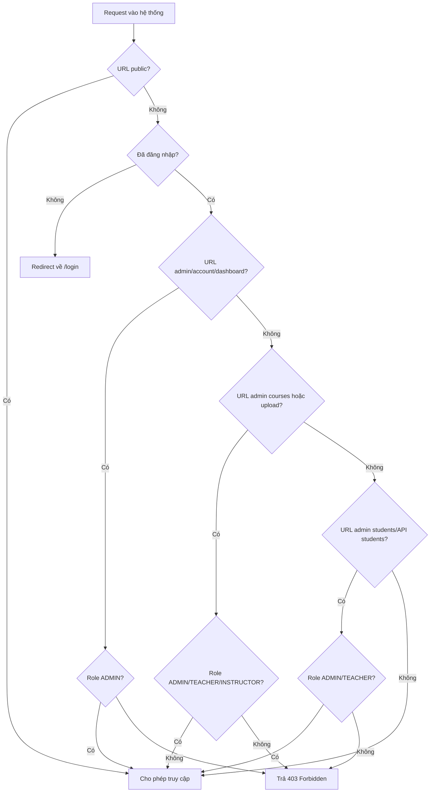

# Ma Trận URL Và Phân Quyền Hệ Thống BKIS

## Mục Tiêu

Tài liệu này tổng hợp các URL hiện có trong hệ thống, phân loại theo UI người dùng, UI admin và REST API. Mục tiêu là có cái nhìn tổng quan trước khi cập nhật lại phân quyền bằng Spring Security.

## Trạng Thái Security Hiện Tại

Trong `SecurityConfig.java`, rule hiện tại:

```java
.requestMatchers("/login", "/captcha", "/css/**", "/js/**", "/img/**",
        "/favicon.ico", "/oauth2/**", "/login/oauth2/**").permitAll()
.anyRequest().authenticated()
```

Ý nghĩa:

- Các URL login, captcha, static resource và OAuth2 callback được public.
- Tất cả URL còn lại chỉ cần đăng nhập.
- Hiện chưa có rule phân quyền theo role cho `/admin/**`, `/api/admin/**`, `/upload/**`.

## Role Hiện Có

| Role | Ý nghĩa dự kiến | Ghi chú hiện tại |
|---|---|---|
| `ADMIN` | Quản trị hệ thống | Nên được phép vào toàn bộ admin UI và admin API. |
| `TEACHER` | Giảng viên hoặc mentor | Có thể được phép quản lý khóa học và học viên nếu nghiệp vụ yêu cầu. |
| `INSTRUCTOR` | Người dạy khóa học | Đang tồn tại cùng `TEACHER`, cần thống nhất phạm vi trách nhiệm. |
| `STUDENT` | Học viên | Nên chỉ vào UI người dùng, khóa học đã mua, thanh toán và hồ sơ cá nhân. |

## URL Public

| Nhóm | URL | Method | Chức năng | Phân quyền hiện tại | Đề xuất |
|---|---|---|---|---|---|
| Login page | `/login` | `GET` | Hiển thị màn hình đăng nhập | Public | Public |
| Form login | `/login` | `POST` | Spring Security xử lý đăng nhập thường | Public | Public |
| OAuth2 start | `/oauth2/**` | `GET` | Bắt đầu đăng nhập Google/Facebook | Public | Public |
| OAuth2 callback | `/login/oauth2/**` | `GET` | Callback SSO từ provider | Public | Public |
| Captcha | `/captcha` | `GET` | Captcha đăng nhập | Public | Public |
| Static CSS | `/css/**` | `GET` | CSS | Public | Public |
| Static JS | `/js/**` | `GET` | JavaScript | Public | Public |
| Static images | `/img/**` | `GET` | Ảnh giao diện | Public | Public |
| Favicon | `/favicon.ico` | `GET` | Icon trình duyệt | Public | Public |

## UI Người Dùng

| Màn hình | URL | Method | Controller | Template | Phân quyền hiện tại | Đề xuất phân quyền |
|---|---|---|---|---|---|---|
| Trang chủ | `/` | `GET` | `HomeController` | `03-home.html` | Đã đăng nhập | Public hoặc authenticated tùy chiến lược bán khóa học. |
| Chi tiết khóa học | `/courses/{id}` | `GET` | `CourseController` | `04-course-detail.html` | Đã đăng nhập | Public nếu chỉ xem giới thiệu, authenticated nếu xem nội dung học. |
| Danh sách học viên | `/students` | `GET` | `StudentController` | `students.html` | Đã đăng nhập | Nên chuyển sang `ADMIN/TEACHER`, vì user thường không nên xem toàn bộ học viên. |
| Upload page | `/upload/` | `GET` | `UploadFileS3Controller` | `05-upload-file.html` | Đã đăng nhập | `ADMIN/TEACHER/INSTRUCTOR`. |
| Upload init | `/upload/init` | `POST` | `UploadFileS3RestController` | API upload | Đã đăng nhập | `ADMIN/TEACHER/INSTRUCTOR`. |
| Upload chunk | `/upload/chunk` | `POST` | `UploadFileS3RestController` | API upload | Đã đăng nhập | `ADMIN/TEACHER/INSTRUCTOR`. |
| Upload complete | `/upload/complete` | `POST` | `UploadFileS3RestController` | API upload | Đã đăng nhập | `ADMIN/TEACHER/INSTRUCTOR`. |

## UI Admin

| Màn hình | URL | Method | Controller | Template | Phân quyền hiện tại | Đề xuất phân quyền |
|---|---|---|---|---|---|---|
| Dashboard admin | `/admin/dashboard/` | `GET` | `DashboardController` | `admin/ad-01-dashboard.html` | Đã đăng nhập | `ADMIN`. |
| Quản lý accounts | `/admin/accounts/` | `GET` | `AccountsController` | `admin/ad-02-accounts.html` | Đã đăng nhập | `ADMIN`. |
| Tạo account | `/admin/accounts/` | `POST` | `AccountsController` | Redirect | Đã đăng nhập | `ADMIN`. |
| Cập nhật account | `/admin/accounts/update` | `POST` | `AccountsController` | Redirect | Đã đăng nhập | `ADMIN`. |
| Quản lý học viên | `/admin/students/` | `GET` | `StudentsController` | `admin/ad-03-students.html` | Đã đăng nhập | `ADMIN`, có thể thêm `TEACHER` nếu mentor cần quản lý. |
| Quản lý khóa học | `/admin/courses` | `GET` | `AdminCoursesController` | `admin/ad-04-courses.html` | Đã đăng nhập | `ADMIN/TEACHER/INSTRUCTOR`. |
| Quản lý khóa học | `/admin/courses/` | `GET` | `AdminCoursesController` | `admin/ad-04-courses.html` | Đã đăng nhập | `ADMIN/TEACHER/INSTRUCTOR`. |
| Tạo khóa học nháp | `/admin/courses/draft` | `POST` | `AdminCoursesController` | Redirect | Đã đăng nhập | `ADMIN/TEACHER/INSTRUCTOR`. |
| Chi tiết khóa học admin | `/admin/courses/{courseId}` | `GET` | `AdminCoursesController` | `admin/ad-04-course-detail.html` | Đã đăng nhập | `ADMIN/TEACHER/INSTRUCTOR`. |
| Update khóa học | `/admin/courses/{courseId}/update` | `POST` | `AdminCoursesController` | Redirect | Đã đăng nhập | `ADMIN/TEACHER/INSTRUCTOR`. |
| Xóa hoặc ẩn khóa học | `/admin/courses/{courseId}/delete` | `POST` | `AdminCoursesController` | Redirect | Đã đăng nhập | `ADMIN`, hoặc `ADMIN/TEACHER` nếu cho phép giảng viên tự quản lý khóa của mình. |
| Tạo module | `/admin/courses/{courseId}/modules` | `POST` | `AdminCoursesController` | Redirect | Đã đăng nhập | `ADMIN/TEACHER/INSTRUCTOR`. |
| Update module | `/admin/courses/{courseId}/modules/{moduleId}/update` | `POST` | `AdminCoursesController` | Redirect | Đã đăng nhập | `ADMIN/TEACHER/INSTRUCTOR`. |
| Xóa module | `/admin/courses/{courseId}/modules/{moduleId}/delete` | `POST` | `AdminCoursesController` | Redirect | Đã đăng nhập | `ADMIN/TEACHER/INSTRUCTOR`. |
| Tạo video | `/admin/courses/{courseId}/modules/{moduleId}/videos` | `POST` | `AdminCoursesController` | Redirect | Đã đăng nhập | `ADMIN/TEACHER/INSTRUCTOR`. |
| Update video | `/admin/courses/{courseId}/modules/{moduleId}/videos/{videoId}/update` | `POST` | `AdminCoursesController` | Redirect | Đã đăng nhập | `ADMIN/TEACHER/INSTRUCTOR`. |
| Xóa video | `/admin/courses/{courseId}/modules/{moduleId}/videos/{videoId}/delete` | `POST` | `AdminCoursesController` | Redirect | Đã đăng nhập | `ADMIN/TEACHER/INSTRUCTOR`. |

## Admin REST API

| API | URL | Method | Controller | Chức năng | Phân quyền hiện tại | Đề xuất phân quyền |
|---|---|---|---|---|---|---|
| Danh sách học viên | `/api/admin/students` | `GET` | `AdminStudentRestController` | Lấy danh sách học viên phân trang | Đã đăng nhập | `ADMIN/TEACHER`. |
| Tổng quan học viên | `/api/admin/students/summary` | `GET` | `AdminStudentRestController` | Lấy metric card cho trang admin students | Đã đăng nhập | `ADMIN/TEACHER`. |
| Chi tiết học viên | `/api/admin/students/{studentId}` | `GET` | `AdminStudentRestController` | Lấy detail modal học viên | Đã đăng nhập | `ADMIN/TEACHER`. |
| Options form | `/api/admin/students/form-options` | `GET` | `AdminStudentRestController` | Lấy course/mentor options cho modal thêm học viên | Đã đăng nhập | `ADMIN/TEACHER`. |
| Tạo học viên | `/api/admin/students` | `POST` | `AdminStudentRestController` | Tạo học viên mới | Đã đăng nhập | `ADMIN`, hoặc `ADMIN/TEACHER` nếu mentor được phép thêm học viên. |

## Ma Trận Quyền Theo Loại User

| Loại user | UI user | UI admin | Quản lý account | Quản lý khóa học | Quản lý học viên | Upload nội dung |
|---|---|---|---|---|---|---|
| Anonymous | Chỉ public pages | Không | Không | Không | Không | Không |
| `STUDENT` | Có | Không | Không | Không | Không | Không |
| `TEACHER` | Có | Một phần | Không | Có | Có thể có | Có |
| `INSTRUCTOR` | Có | Một phần | Không | Có | Không hoặc chỉ học viên khóa mình | Có |
| `ADMIN` | Có | Toàn bộ | Có | Có | Có | Có |

## Rule Spring Security Đề Xuất

Phiên bản phân quyền tổng quan nên đi theo thứ tự từ cụ thể đến tổng quát:

```java
.authorizeHttpRequests(auth -> auth
        .requestMatchers("/login", "/captcha", "/css/**", "/js/**", "/img/**",
                "/favicon.ico", "/oauth2/**", "/login/oauth2/**").permitAll()
        .requestMatchers("/admin/accounts/**", "/admin/dashboard/**").hasRole("ADMIN")
        .requestMatchers("/admin/courses/**").hasAnyRole("ADMIN", "TEACHER", "INSTRUCTOR")
        .requestMatchers("/admin/students/**", "/api/admin/students/**").hasAnyRole("ADMIN", "TEACHER")
        .requestMatchers("/upload/**").hasAnyRole("ADMIN", "TEACHER", "INSTRUCTOR")
        .anyRequest().authenticated())
```

Nếu muốn cho trang chủ và chi tiết khóa học public:

```java
.requestMatchers("/", "/courses/**").permitAll()
```

Rule này nên đặt trước `.anyRequest().authenticated()`.

## Luồng Kiểm Tra Quyền Tổng Quan



## Nhận Xét Kỹ Thuật

- Hiện tại hệ thống đã sinh authority theo role local bằng format `ROLE_` trong `CustomUserDetails`, `CustomOAuth2User` và `CustomOidcUser`.
- Có thể dùng trực tiếp `hasRole("ADMIN")` vì Spring Security tự thêm prefix `ROLE_`.
- Với các nghiệp vụ sâu hơn như giảng viên chỉ sửa khóa học của chính mình, nên thêm kiểm tra ở service hoặc dùng `@PreAuthorize` theo ownership.
- Các API admin nên có rule riêng, không chỉ dựa vào việc UI admin đã bị chặn.
- Cần thống nhất ý nghĩa `TEACHER` và `INSTRUCTOR` để tránh phân quyền bị trùng hoặc mâu thuẫn.

## Đề Xuất Thứ Tự Cập Nhật

1. Chốt chiến lược public cho `/` và `/courses/{id}`.
2. Chốt vai trò `TEACHER` và `INSTRUCTOR`.
3. Cập nhật `SecurityConfig` theo rule tổng quan.
4. Thêm trang 403 thân thiện.
5. Ẩn/hiện menu admin theo role trong header/sidebar.
6. Nếu cần, bổ sung phân quyền sâu tại service cho course ownership.
## Cap Nhat 2026-05-25

Phần login/SSO/captcha hiện tại nên đọc theo ma trận sau:

| Nhóm | URL | Method | Ghi chú |
|---|---|---|---|
| Login page | `/login` | `GET` | Public |
| Form login | `/login` | `POST` | Public, nhưng bị `CaptchaFilter` kiểm tra captcha |
| Captcha image | `/captcha/image` | `GET` | Public, sinh captcha ảnh từ server |
| OAuth2 start | `/oauth2/**` | `GET` | Public, không đi qua captcha |
| OAuth2 callback | `/login/oauth2/**` | `GET` | Public, không đi qua captcha |

Rule public nên bao gồm ít nhất:

```java
.requestMatchers("/login", "/captcha/**", "/css/**", "/js/**", "/img/**",
        "/favicon.ico", "/oauth2/**", "/login/oauth2/**").permitAll()
```
