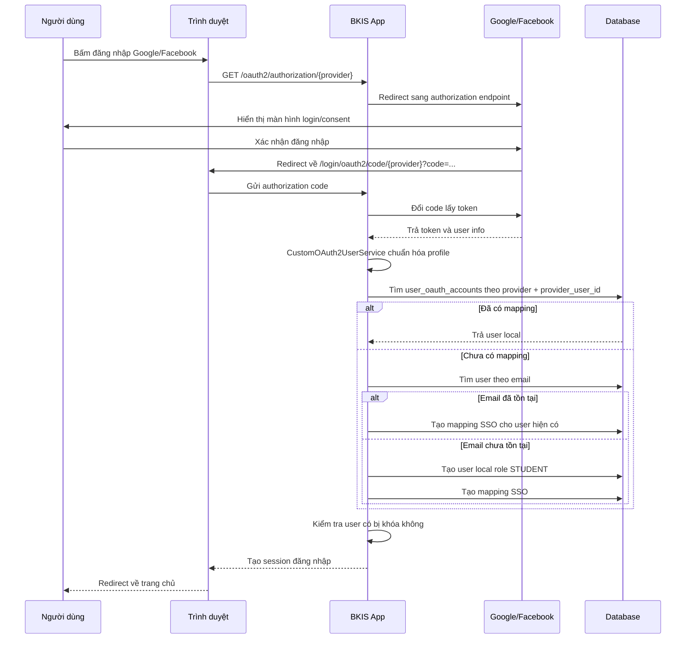
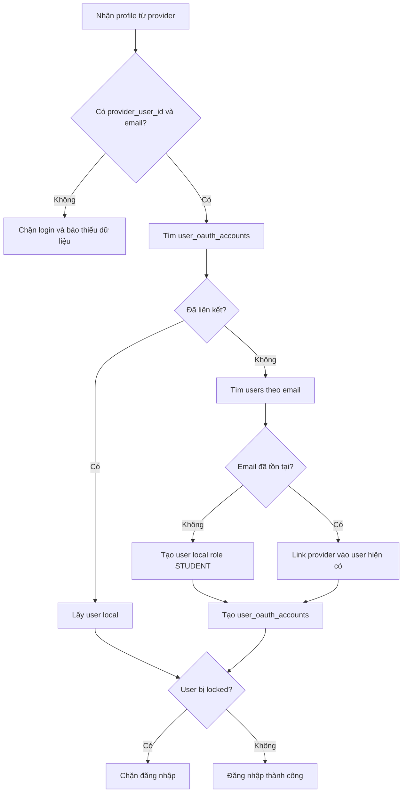

# Tài Liệu SSO Google/Facebook Cho Hệ Thống BKIS

## Mục Tiêu

Tài liệu này mô tả cách cấu hình đăng nhập SSO cho hệ thống BKIS bằng Spring Security OAuth2 Login. Hệ thống hiện hỗ trợ đăng nhập thường bằng username/password, remember-me bằng cookie, đăng nhập SSO qua Google/Facebook và mapping tài khoản SSO về user local.

Nguồn tham khảo chính thức:

- Spring Security OAuth2 Login: https://docs.spring.io/spring-security/reference/servlet/oauth2/login/index.html
- Google OAuth 2.0 Web Server Applications: https://developers.google.com/identity/protocols/oauth2/web-server
- Meta Facebook Login for Web: https://developers.facebook.com/docs/facebook-login/web/

## Thành Phần Code Liên Quan

- `src/main/java/vn/edu/bkis/security/SecurityConfig.java`: bật form login, remember-me và OAuth2 login khi có cấu hình client.
- `src/main/java/vn/edu/bkis/security/CustomOAuth2UserService.java`: lấy profile từ provider, chuẩn hóa dữ liệu và link/tạo user local.
- `src/main/java/vn/edu/bkis/security/CustomOAuth2User.java`: principal dùng sau khi đăng nhập SSO thành công.
- `src/main/java/vn/edu/bkis/model/AuthProvider.java`: định nghĩa provider `GOOGLE`, `FACEBOOK`.
- `src/main/java/vn/edu/bkis/model/UserOAuthAccount.java`: lưu liên kết giữa user local và tài khoản provider.
- `src/main/java/vn/edu/bkis/repository/UserOAuthAccountRepository.java`: truy vấn liên kết SSO.
- `src/main/resources/application.properties`: cấu hình bật/tắt nút SSO và OAuth2 client.
- `src/main/resources/templates/01-login.html`: màn hình đăng nhập hiển thị nút Google/Facebook.

## Nguyên Tắc Thiết Kế

SSO chỉ dùng để xác thực danh tính người dùng. Role, trạng thái khóa tài khoản và quyền truy cập vẫn lấy từ database local của hệ thống.

Luồng xử lý chính:

- Google/Facebook xác thực người dùng.
- Hệ thống nhận `email`, `provider_user_id`, `name`, `picture`.
- Hệ thống tìm liên kết trong bảng `user_oauth_accounts`.
- Nếu đã có liên kết, dùng user local đã được link.
- Nếu chưa có liên kết, tìm user local theo email.
- Nếu email chưa tồn tại, tạo user local mới với role mặc định `STUDENT`.
- Nếu user local bị khóa, chặn đăng nhập dù provider xác thực thành công.

## Cần Cấu Hình Gì

### 1. Dependency

Project cần dependency OAuth2 client:

```kotlin
implementation("org.springframework.boot:spring-boot-starter-oauth2-client")
```

### 2. Bật Nút SSO Trên Login Page

Trong `src/main/resources/application.properties`:

```properties
app.security.sso.google-enabled=true
app.security.sso.facebook-enabled=true
```

Chỉ bật provider khi đã có `client-id`, `client-secret` và redirect URI đã khai báo đúng trên Google/Facebook.

### 3. Cấu Hình Google OAuth2

```properties
spring.security.oauth2.client.registration.google.client-id=${GOOGLE_CLIENT_ID}
spring.security.oauth2.client.registration.google.client-secret=${GOOGLE_CLIENT_SECRET}
spring.security.oauth2.client.registration.google.scope=openid,profile,email
```

Google là OpenID Connect provider phổ biến nên Spring Boot đã có sẵn phần lớn endpoint mặc định. Với nhu cầu hiện tại, không cần tự cấu hình thêm `provider.google.*`.

### 4. Cấu Hình Facebook OAuth2

```properties
spring.security.oauth2.client.registration.facebook.client-id=${FACEBOOK_CLIENT_ID}
spring.security.oauth2.client.registration.facebook.client-secret=${FACEBOOK_CLIENT_SECRET}
spring.security.oauth2.client.registration.facebook.scope=email,public_profile
```

Facebook không trả dữ liệu giống Google. Code hiện tại đọc các field:

- `id`: mã user trên Facebook.
- `email`: email người dùng, bắt buộc với hệ thống hiện tại.
- `name`: tên hiển thị.
- `picture.data.url`: ảnh đại diện.

### 5. Biến Môi Trường Local

Ví dụ cấu hình bằng PowerShell:

```powershell
$env:GOOGLE_SSO_ENABLED="true"
$env:GOOGLE_CLIENT_ID="your-google-client-id"
$env:GOOGLE_CLIENT_SECRET="your-google-client-secret"
$env:FACEBOOK_SSO_ENABLED="true"
$env:FACEBOOK_CLIENT_ID="your-facebook-app-id"
$env:FACEBOOK_CLIENT_SECRET="your-facebook-app-secret"
```

Khuyến nghị cập nhật `application.properties` theo hướng dùng biến môi trường:

```properties
app.security.sso.google-enabled=${GOOGLE_SSO_ENABLED:false}
app.security.sso.facebook-enabled=${FACEBOOK_SSO_ENABLED:false}

spring.security.oauth2.client.registration.google.client-id=${GOOGLE_CLIENT_ID}
spring.security.oauth2.client.registration.google.client-secret=${GOOGLE_CLIENT_SECRET}
spring.security.oauth2.client.registration.google.scope=openid,profile,email

spring.security.oauth2.client.registration.facebook.client-id=${FACEBOOK_CLIENT_ID}
spring.security.oauth2.client.registration.facebook.client-secret=${FACEBOOK_CLIENT_SECRET}
spring.security.oauth2.client.registration.facebook.scope=email,public_profile
```

## Redirect URI Cần Khai Báo

Spring Security dùng callback mặc định:

```text
{baseUrl}/login/oauth2/code/{registrationId}
```

Với local port `8888`:

```text
http://localhost:8888/login/oauth2/code/google
http://localhost:8888/login/oauth2/code/facebook
```

Với production, ví dụ domain `https://bkis.example.com`:

```text
https://bkis.example.com/login/oauth2/code/google
https://bkis.example.com/login/oauth2/code/facebook
```

Redirect URI phải khớp chính xác scheme, domain, port và path. Nếu sai sẽ gặp lỗi `redirect_uri_mismatch`.

## Tạo Key Google Ở Đâu

Tạo tại Google Cloud Console:

```text
https://console.cloud.google.com/apis/credentials
```

Các bước:

1. Tạo hoặc chọn project.
2. Vào `APIs & Services`.
3. Cấu hình `OAuth consent screen`.
4. Vào `Credentials`.
5. Chọn `Create Credentials`.
6. Chọn `OAuth client ID`.
7. Chọn application type là `Web application`.
8. Thêm `Authorized redirect URIs`.
9. Tạo client.
10. Lấy `Client ID` và `Client Secret`.
11. Đưa giá trị vào biến môi trường hoặc cấu hình runtime.

Redirect URI local cần thêm cho Google:

```text
http://localhost:8888/login/oauth2/code/google
```

Production phải thêm redirect URI HTTPS tương ứng với domain thật.

## Tạo Key Facebook Ở Đâu

Tạo tại Meta for Developers:

```text
https://developers.facebook.com/
```

Các bước:

1. Vào `My Apps`.
2. Tạo app mới hoặc chọn app hiện có.
3. Thêm use case hoặc product liên quan `Facebook Login`.
4. Vào phần cấu hình Facebook Login.
5. Thêm `Valid OAuth Redirect URIs`.
6. Lấy `App ID` làm `client-id`.
7. Lấy `App Secret` làm `client-secret`.
8. Cấu hình scope `email,public_profile`.
9. Khi lên production, chuyển app sang chế độ phù hợp và khai báo domain thật.

Redirect URI local cần thêm cho Facebook:

```text
http://localhost:8888/login/oauth2/code/facebook
```

Lưu ý: Facebook có thể không trả email nếu user không có email hợp lệ, app chưa xin quyền `email`, hoặc app chưa được cấu hình/quyền phù hợp. Code hiện tại yêu cầu email nên trường hợp thiếu email sẽ bị chặn đăng nhập.

## URL Đăng Nhập SSO

Spring Security tự tạo endpoint bắt đầu đăng nhập:

```text
/oauth2/authorization/google
/oauth2/authorization/facebook
```

Sau khi provider xác thực xong, provider redirect về:

```text
/login/oauth2/code/google
/login/oauth2/code/facebook
```

Không cần tự viết controller cho `/login/oauth2/code/*`; Spring Security xử lý endpoint này.

## Luồng Cấu Hình Provider

```mermaid
flowchart TD
    A[Chọn provider Google hoặc Facebook] --> B[Tạo OAuth app trên provider]
    B --> C[Khai báo redirect URI]
    C --> D[Lấy Client ID và Client Secret]
    D --> E[Đưa secret vào biến môi trường]
    E --> F[Cấu hình application.properties]
    F --> G[Bật nút SSO trên login page]
    G --> H[Test endpoint /oauth2/authorization/{provider}]
    H --> I{Đăng nhập thành công?}
    I -- Có --> J[Kiểm tra users và user_oauth_accounts]
    I -- Không --> K[Kiểm tra redirect URI, scope, client id/secret]
```

## Luồng Đăng Nhập SSO



## Luồng Mapping User Local



## Schema Dữ Liệu Tối Thiểu

Bảng `users` tiếp tục là nguồn dữ liệu chính để quản lý tài khoản local:

```text
id
username
email
password_hash
full_name
profile_picture_url
role
locked
failed_login_attempts
```

Bảng `user_oauth_accounts` dùng để lưu liên kết SSO:

```text
id
user_id
provider
provider_user_id
email
display_name
profile_picture_url
created_at
updated_at
```

Ràng buộc nên có:

```text
UNIQUE(provider, provider_user_id)
INDEX(user_id)
INDEX(email)
```

Với user được tạo từ SSO, `password_hash` chỉ là mật khẩu random đã encode để thỏa cấu trúc user hiện tại. Người dùng không thể đăng nhập thường bằng mật khẩu đó nếu chưa đi qua luồng đặt lại mật khẩu.

## Checklist Test Local

1. App chạy đúng port `8888`.
2. Redirect URI trên provider đúng với `/login/oauth2/code/{registrationId}`.
3. Có biến môi trường `GOOGLE_CLIENT_ID`, `GOOGLE_CLIENT_SECRET`, `FACEBOOK_CLIENT_ID`, `FACEBOOK_CLIENT_SECRET`.
4. Đã bật `app.security.sso.google-enabled=true` hoặc `app.security.sso.facebook-enabled=true`.
5. Truy cập được `/oauth2/authorization/google` hoặc `/oauth2/authorization/facebook`.
6. Sau login thành công, kiểm tra dữ liệu trong `users` và `user_oauth_accounts`.
7. User local bị `locked=true` phải bị chặn đăng nhập SSO.

## Lỗi Thường Gặp

### `redirect_uri_mismatch`

Nguyên nhân thường là URI khai báo trên Google/Facebook không khớp với callback Spring Security gửi đi. Kiểm tra lại scheme `http/https`, domain, port `8888` và path `/login/oauth2/code/{registrationId}`.

### Không Thấy Nút Google/Facebook

Kiểm tra các cấu hình:

```properties
app.security.sso.google-enabled=true
app.security.sso.facebook-enabled=true
```

Nếu provider chưa có client config hợp lệ thì không nên bật nút để tránh người dùng bấm vào luồng chưa cấu hình.

### App Không Bật OAuth2 Login

Nguyên nhân thường là chưa có cấu hình `spring.security.oauth2.client.registration.*`, nên Spring không tạo `ClientRegistrationRepository`. Code hiện tại cố ý chỉ bật `oauth2Login` khi bean này tồn tại để app vẫn chạy được khi chưa cấu hình SSO.

### Facebook Không Trả Email

Kiểm tra scope:

```properties
spring.security.oauth2.client.registration.facebook.scope=email,public_profile
```

Nếu vẫn thiếu email, cần thiết kế thêm màn hình yêu cầu người dùng nhập email sau SSO. Với code hiện tại, thiếu email sẽ bị chặn để tránh tạo user không thể định danh.

## Quy Tắc Bảo Mật

- Không commit client secret thật vào Git.
- Không log access token, ID token hoặc authorization code.
- Production phải dùng HTTPS.
- Client secret nên lấy từ biến môi trường hoặc secret manager.
- User local bị khóa vẫn phải bị chặn dù đăng nhập qua SSO.
- Role không lấy trực tiếp từ Google/Facebook, chỉ lấy từ DB local.
- Redirect URI production phải dùng domain thật, không dùng localhost.

## Việc Nên Làm Tiếp Theo

- Xóa block cấu hình SSO đang bị lặp trong `application.properties`.
- Chuyển `app.security.sso.*-enabled` sang biến môi trường để dễ bật/tắt theo môi trường.
- Thêm trang lỗi SSO thân thiện khi thiếu email hoặc user bị khóa.
- Thêm audit log cho các lần đăng nhập SSO.
- Thêm màn hình admin xem/link/unlink tài khoản SSO của user.
